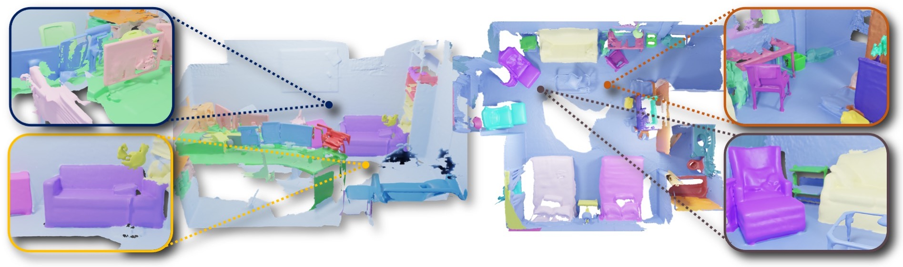

## UnScene3D: Unsupervised 3D Instance Segmentation for Indoor Scenes
<div align="center">
<a href="https://rozdavid.github.io/">David Rozenberszki</a>, <a href="https://orlitany.github.io/">Or Litany</a>, <a href="https://www.3dunderstanding.org/">Angela Dai</a>
</div>

### Implementation for our CVPR 2024 paper

UnScene3D fully unsupervised 3D instance segmentation method, generating pseudo masks through self-supervised color and geometry features and refining them via self-training. Ultimately we achieve a 300% improvement over existing unsupervised methods, even in complex and cluttered 3D scenes and provide a powerful pretraining method. 

<div align="center">
<a href="https://rozdavid.github.io/unscene3d">Project Webpage</a> | <a href="https://arxiv.org/abs/2303.14541">ArXiv Paper</a> | <a href="https://www.youtube.com/watch?v=ukovRRni79c">Video</a>
</div>




For any code-related or other questions open an issue [here](https://github.com/RozDavid/UnScene3D/issues) or contact [David Rozenberszki](https://rozdavid.github.io)
If you found this work helpful for your research, please consider citing our paper:

```text
@inproceedings{rozenberszki2024unscene3d,
    title={UnScene3D: Unsupervised 3D Instance Segmentation for Indoor Scenes},
    author={Rozenberszki, David and Litany, Or and Dai, Angela},
    booktitle = {Proceedings of the IEEE/CVF Conference on Computer Vision and Pattern Recognition (CVPR)},
    year={2024}
}
```  

### README structure
- [Installation](#installation) - setting up a conda environment and building/installing custom cpp tool s
- [Data Preprocessing](#data-download-and-preprocessing) - we primarily use the ScanNet dataset, we have to preprocess them to get aligned point clouds and 2D images
- [Pseudo Mask Generation](#pseudo-mask-generation) - we generate pseudo masks using self-supervised features and extract them for self-training
- [Self-Training](#self-training) - we mostly follow the training procedure of Mask3D, but we use the pseudo masks, noise robust losses, self-training iterations, and a class-agnostic evaluation
- [Available Resources](#available-resources) - we provide the pseudo datasets, pretrained models for evaluation and inference and loads of visualized scenes. 

### Roadmap
- [x] Pseudo Mask Generation
- [x] Self-Training
- [x] Evaluation
- [x] Upload pretrained models, datasets, visualizations and training resources
- [x] Added docker container for easy setup 

### Installation

The codebase was developed and tested on Ubuntu 20.04, with various GPU versions [RTX_2080, RTX_3060, RXT_3090, RXT_A6000] and NVCC 11.6
We provide an Anaconda environment with the dependencies, to install run

```sh
conda env create -f conf/unscene3d_env.yml
conda activate unscene3d
```


Additionally, [MinkowskiEngine](https://github.com/NVIDIA/MinkowskiEngine) and [Detectron2](https://detectron2.readthedocs.io/en/latest/tutorials/install.html) has to be installed manually with a specified CUDA version. 
E.g. for CUDA 11.6 run

```sh
export CUDA_HOME=/usr/local/cuda-11.6
pip install -U git+https://github.com/NVIDIA/MinkowskiEngine -v --no-deps
python -m pip install 'git+https://github.com/facebookresearch/detectron2.git'
```

Finally, for building the custom cpp/cuda tools, run
```sh
cd utils/cpp_utils && python setup.py install
cd ../cuda_utils && python setup.py install
cd ../../third_party/pointnet2 && python setup.py install
cd ../..
```

#### Running with Docker

Additionally we also provide dockerized container for easier requirement management. For this we recommend to download the necessary datasets and symlink it to the ```data``` folder in this repo. 

We expect to have Docker installed on your system (example [here](https://docs.docker.com/desktop/install/ubuntu/)), and change the ```--volume``` mappings in the ```.devcontainer/start.sh``` file. Here we expect ```UnScene3D/data/ScanNet``` be the raw ScanNet dataset, while ````as/UnScene3D/data``` should be the directory where Mask3D processed files live. Example preprocessed datasets can be downloaded from [here](#available-resources). 

Finally, one could initialize the system with 
```
    . .devcontainer/start.sh
```

### Data download and preprocessing
After installing the dependencies, we preprocess the datasets.

We provide example training and inference scripts for the ScanNet dataset. For downloading the raw data, please refer to the instructions on the official [GitHub page](https://github.com/ScanNet/ScanNet).
For the pseudo mask generation, we dont need any specific data preprocessing, but have to extract the ScanNet images from their .sens files.
For this please refer to the [ScanNet repository SensReader](https://github.com/ScanNet/ScanNet/tree/master/SensReader/python), where you can use the python script to extract every Nth frame from the .sens files. In our experiments we use every 20th frame.

### Pseudo Mask Generation
Our module combines self-supervised pretrained features from 2D/3D domains with a geometric oversegmentation of scenes, allowing for efficient representation of scene properties. We use a greedy approach with the Normalized Cut algorithm to iteratively separate foreground-background segments. 
After each iteration, we mask out predicted segment features and continue this process until there are no segments remaining. This method is demonstrated in the included animation.


To extract pseudo masks using both modalities and DINO features, run
```sh
cd pseudo_masks
. scripts/unscene3d_dino_2d3d.sh
```

The most important parameters are the following:
- `freemask.modality` - the modality to use for the pseudo mask generation, either `geom`, `color` or `both`
- `freemask.affinity_tau` - the threshold for the Normalized Cut algorithm, for ablation studies check our supplementary material
- `data.segments_min_vert_nums` - the minimum number of vertices in a segment after oversegmentation, for ablation studies check our supplementary material
- `freemask.min_segment_size` - the minimum number of segments in a pseudo mask, for ablation studies check our supplementary material
- `freemask.separation_mode` - the mode of the Normalized Cut algorithm, either `max`, `avg`, `all` or `largest`, for ablation studies check our supplementary material

### Self-Training


We use the pseudo masks generated in the previous step to train the model in a self-training manner. We use the pseudo masks as ground truth and train the model with a noise robust loss, which is a combination of the standard cross-entropy loss and the Dice loss with low quality matches filtered by a 3D version of DropLoss. First we have to format the data for the self-train cycles. 
In this part of the code we rely the wast majority on the [Mask3D](https://github.com/JonasSchult/Mask3D) codebase, with some minor modifications and also follow their logic on the training. 

To save the datasets for self-training, run
```sh
python datasets/preprocessing/freemask_preprocessing.py preprocess 
```
The most important parameters are the following:
- `--data_dir` - the path to the raw ScanNet dataset
- `--save_dir` - the path to save the processed data
- `--modes` - default is ("train", "validation"), but can be selected for either
- `--git_repo` - the path to the ScanNet git repository, needed for the ScanNet label mapping
- `--oracle` - if selected, the original annotation is used for pseudo masks in a class-agnostic manner. needed to create a version for evaluation
- `--freemask_dir` - the path to the pseudo masks generated in the previous step
- `--n_jobs` - makes you wait less if you use more cores :)

Finally, to train the model with the pseudo masks over multiple stages of self-training iterations, run
```sh
. scripts/mask3d_DINO_CSC_self_train.sh
```


### Available Resources

We provide the [pretrained weights](https://kaldir.vc.in.tum.de/unscene3d/model_weights/CSC_train_Res16UNet34C_2cm.pth) for the CSC model, which is used for self-superivsed feature extraction. This was trained on teh training scenes of ScanNet, with default parameters. 

#### Preprocessed Datasete
We preprocessed a set of pseudo datasets in different variations, which can be used for self-training. We provide the following datasets: 

| **Dataset Name**                                                                                      | **Description**                                                                                                 |
|-------------------------------------------------------------------------------------------------------|-------------------------------------------------------------------------------------------------------------|
| [scannet_freemask_oracle](https://kaldir.vc.in.tum.de/unscene3d/datasets/scannet_freemask_oracle.zip) | The oracle dataset using the GT ScanNet mask annotation, mostly used for evaluation only.                   |
| [unscene3d_dino](https://kaldir.vc.in.tum.de/unscene3d/datasets/unscene3d_dino.zip)                   | Our proposed psuedo mask dataset, using projected 2D features from DINO for the NCut stage.                 |
| [unscene3d_dino_csc](https://kaldir.vc.in.tum.de/unscene3d/datasets/unscene3d_dino_csc.zip)           | Our proposed psuedo mask dataset, using both 3D CSC and projected 2D features from DINO for the NCut stage. |
| [unscene3d_arkit](https://kaldir.vc.in.tum.de/unscene3d/datasets/unscene3d_arkit.zip)                 | Using 3D features on the ArKitScenes dataset for the NCut stage.                                                              |

#### Pretrained Models
We also provide the trained checkpoints for the self-training iterations, which can be used for evaluation or inference purposes. The checkpoints and the corresponding training logs are available for the following setups:

| **Setup Name**  | **Description**                                                                                                                |
|---------------|--------------------------------------------------------------------------------------------------------------------------------|
| [unscene3d_CSC_self_train_3](https://kaldir.vc.in.tum.de/unscene3d/checkpoints/unscene3d_CSC_self_train_3.zip)        | The model trained with pseudo masks using 3D features only, and after 3 self-training iteration.                               |
| [unscene3d_DINO_self_train_3](https://kaldir.vc.in.tum.de/unscene3d/checkpoints/unscene3d_DINO_self_train_3.zip)        | The model trained with pseudo masks using 2D features only, and after 3 self-training iteration.                               |
| [unscene3d_DINO_CSC_self_train_3](https://kaldir.vc.in.tum.de/unscene3d/checkpoints/unscene3d_DINO_CSC_self_train_3.zip)     | The model trained with pseudo masks using both 2D and 3D features only, and after 3 self-training iteration.                   |
| [unscene3d_arkit_self_train_2](https://kaldir.vc.in.tum.de/unscene3d/checkpoints/unscene3d_arkit_self_train_2.zip)     | The model trained with the ArKitScenes and pseudo masks extracted from 3D features only, and after 2 self-training iterations. |

#### Visualizations

Finally, we show some qualitative results of the pseudo mask generation and the self-training iterations for the different setups.
You can download the visualizations for [3D only](https://kaldir.vc.in.tum.de/unscene3d/visualizations/CSC.zip) and both [2D/3D](https://kaldir.vc.in.tum.de/unscene3d/visualizations/DINO_CSC.zip) psuedo masks. 
For opening the visualizations in your browser, please use [PyViz3D](https://github.com/francisengelmann/PyViz3D).

